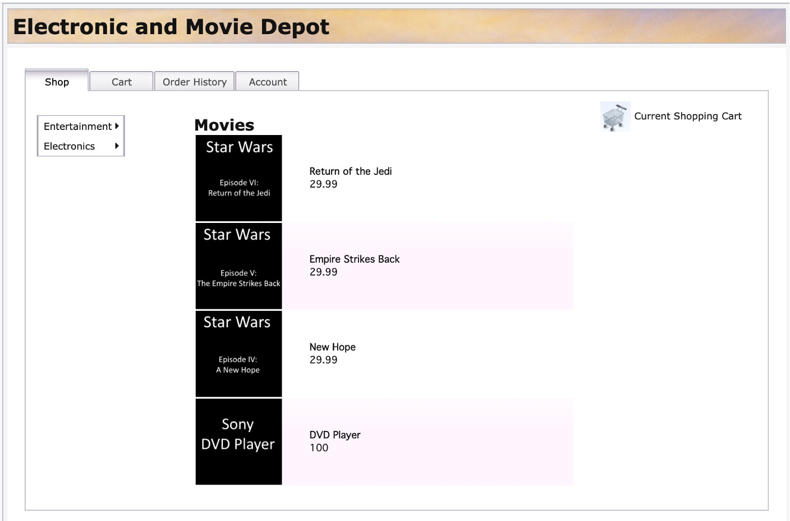

 ## Traditional WebSphere application modernized for Quarkus 
The **Customer Order Services** application is a JEE based store-front shopping application, built for traditional WebSphere Application Server during the early days of the Web 2.0 movement. Users interact directly with a browser-based interface and manage their cart to submit orders. This application is built using the traditional 3-Tier Architecture model, with an HTTP server, an application server, and a supporting database. More information about the app is available at  
 https://ibm-cloud-architecture.github.io/modernization-playbook/applications/liberty/

This application is an exemplar of a traditional WAS enterprise app going thru a modernization journey to cloud native. As a first step, it was converted to WebSphere Liberty as described in the repo linked above.  
This repo contains a next step in modernization journey to cloud native  - running WebSphere app natively on Quarkus. 


## The outcomes:
Memory usage footprint is reduced by ~30x from 1.25G to under 40M


Startup time is reduced from 7sec to under 100ms


## How to migrate from JEE to Quarkus
Coming soon  

## How to run on your laptop:

### Start application DB2 database 
The app requires DB2 database. You can run it in a pre-built container:
```
docker run -itd --name db2-cos --privileged=true -p 50000:50000 -e LICENSE=accept -e DB2INST1_PASSWORD=db2inst1 -e DBNAME=orderdb vandepol/db2-cos
```

### Quarkus setup on Mac
https://quarkus.io/guides/building-native-image

List installed JDKs  
```
/usr/libexec/java_home -V  

Matching Java Virtual Machines (6):
    11.0.8, x86_64:	"GraalVM CE 19.3.3"	/Library/Java/JavaVirtualMachines/graalvm-ce-lts-java11-19.3.3/Contents/Home
    11.0.8, x86_64:	"GraalVM CE 20.2.0"	/Library/Java/JavaVirtualMachines/graalvm-ce-java11-20.2.0/Contents/Home
    11, x86_64:	"OpenJDK 11"	/Library/Java/JavaVirtualMachines/jdk-11.jdk/Contents/Home
    1.8.0_262+10, x86_64:	"GraalVM CE 20.2.0"	/Library/Java/JavaVirtualMachines/graalvm-ce-java8-20.2.0/Contents/Home
    1.8.0_262+10, x86_64:	"GraalVM CE 19.3.3"	/Library/Java/JavaVirtualMachines/graalvm-ce-lts-java8-19.3.3/Contents/Home
    1.8.0_251, x86_64:	"Java SE 8"	/Library/Java/JavaVirtualMachines/jdk1.8.0_251.jdk/Contents/Home
```

Setup env vars
```
export GRAALVM_HOME=/Library/Java/JavaVirtualMachines/graalvm-ce-java11-20.2.0/Contents/Home
export JAVA_HOME=${GRAALVM_HOME}
export PATH=${GRAALVM_HOME}/bin:$PATH
```

### Build and run application in Quarkus in JVM mode
```
cd CustomerOrderServices
./mvnw compile quarkus:dev
```  
Access the App
http://localhost:8080/CustomerOrderServicesWeb/index.html

### Build and run application in native executable mode
```
CustomerOrderServices
./mvnw package -Pnative
target/customer-order-services-quarkus-1.0-SNAPSHOT-runner
```

Access the App
http://localhost:8080/CustomerOrderServicesWeb/index.html




